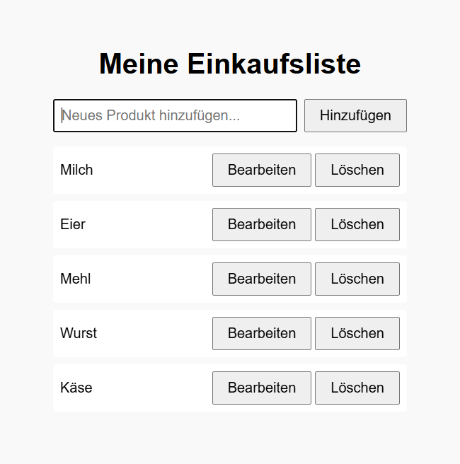

# Meine Einkaufsliste (Vanilla JS)

Eine minimalistische, schnelle **Einkaufsliste im Browser**: Produkte hinzufügen, bearbeiten, löschen – dauerhaft gespeichert mit **LocalStorage**. Funktioniert komplett **offline**, keine Abhängigkeiten, ein einziges `index.html`.

> Hinweis: Die Liste speichert Daten unter dem LocalStorage-Key **`einkaufsliste`** deines Browsers. Löschen des Browser-Speichers setzt die Liste zurück.

## Screenshot

So sieht die App mit Beispiel-Daten aus (inkl. aktivem Bearbeiten-Modus):



## Features

- **Hinzufügen** neuer Items per Eingabefeld und Button.
- **Bearbeiten** direkt in der Liste (Enter = Speichern, Esc = Abbrechen).
- **Löschen** mit Sicherheitsabfrage.
- **Persistenz** in `localStorage` (Key: `einkaufsliste`).
- **Responsives** Layout, läuft offline – nur eine HTML-Datei.
- **Tastaturfreundlich** dank Enter/Escape-Handling.

## Quickstart

1. Dieses Repo klonen oder die Dateien herunterladen.
2. **`index.html` im Browser öffnen.** Mehr ist nicht nötig.

Optional: Für eine Online-Demo über **GitHub Pages** einfach den `main`-Branch veröffentlichen und Pages auf `/ (root)` setzen.

## Benutzung

- Schreibe z. B. „Milch 1,5%“ in das Feld und klicke **Hinzufügen**.
- Klicke bei einem Eintrag auf **Bearbeiten**, ändere den Text und bestätige mit **Enter** (oder **Speichern**).
- Abbrechen mit **Esc** (oder **Abbrechen**).
- **Löschen** entfernt den Eintrag nach Bestätigung.

## Code-Überblick

- **Datenhaltung:** Array `items` wird in **LocalStorage** (Key `einkaufsliste`) persistiert.
- **Rendering:** Funktion `render()` baut die Liste aus `items` neu auf.
- **Bearbeiten-Flow:** `startEditing(index)` → `finishEditing(index, newText)` bzw. `cancelEditing(index)`.
- **Events:** Form-Submit für Hinzufügen, Buttons für Bearbeiten/Löschen, **Enter/Escape** im Editierfeld.
- **Sicherheit:** Leere Eingaben werden verhindert, Löschen erfordert **Confirm**.

Der vollständige Code steckt in **`index.html`** (Inline-Script).

## Projektstruktur

```
.
└── index.html
```

## Roadmap-Ideen

- Reorder per Drag & Drop
- Checkboxen zum Abhaken (und Filter „offen/erledigt“)
- Kategorien/Abschnitte (z. B. Obst, Backwaren, Getränke)
- Import/Export (JSON)
- PWA: Installierbare Offline-App
- Tests (z. B. mit Playwright)

## Lizenz

MIT – verwende, ändere und teile nach Belieben.

---

© 2025 – Einkaufsliste
